# 🧮 Advanced Calculator – Flutter Lab 3

<div align="center">


</div>

---

## 👤 Thông tin sinh viên

| Trường | Nội dung |
|--------|---------|
| **Họ và tên** | Trần Cao Tiến Huy |
| **MSSV** | 2224802010173 |
| **Package name** | `advancedcalculator_2224802010173_trancaotienhuy` |
| **Deadline** | 11:59 PM – 24/04/2026 |

---

## 📖 Mô tả dự án

Ứng dụng **máy tính nâng cao** xây dựng bằng Flutter, hỗ trợ **ba chế độ hoạt động** (Cơ bản, Khoa học, Lập trình viên) với bộ phân tích biểu thức toán học đầy đủ, bao gồm độ ưu tiên toán tử (PEMDAS/BODMAS), nhân ngầm định, tự động đóng ngoặc và xử lý lỗi miền giá trị. Ứng dụng tích hợp lưu trữ bền vững (SharedPreferences), lịch sử tính toán, chuyển đổi giao diện sáng/tối, chức năng bộ nhớ đầy đủ (M+/M−/MR/MC) và bộ kiểm thử toàn diện với **233 test case** phân thành 19 nhóm (A–S).

---

## ✨ Tính năng nổi bật

### 🔢 Ba chế độ máy tính

| Chế độ | Bố cục | Chức năng |
|--------|--------|-----------|
| **Cơ bản** | Lưới 4 × 5 | Các phép tính số học cơ bản, phần trăm (%), đổi dấu (+/−), xoá từng ký tự (⌫), xoá toàn bộ (AC) |
| **Khoa học** | Lưới 6 × 6 | Lượng giác (sin/cos/tan/asin/acos/atan), logarithm (log/log2/ln), lũy thừa (x²/x³/xʸ), căn (√/∛), giai thừa (n!), hằng số (π/e), bộ nhớ (M+/M−/MR/MC) |
| **Lập trình viên** | Tùy chỉnh | Số học thập lục phân, phép tính bit (AND/OR/XOR/NOT 32-bit), dịch bit (<</>>), nhập số hex A–F |

---

### 🔬 Hàm khoa học chi tiết

#### Lượng giác
| Hàm | Mô tả | Chế độ DEG | Chế độ RAD |
|-----|-------|-----------|-----------|
| `sin(x)` | Sin | Nhận độ, trả kết quả | Nhận radian |
| `cos(x)` | Cosine | Nhận độ, trả kết quả | Nhận radian |
| `tan(x)` | Tangent | tan(90°) → Error | tan(π/2) → Error |
| `asin(x)` | Arcsin | Kết quả tính bằng độ | Kết quả tính bằng radian |
| `acos(x)` | Arccos | Kết quả tính bằng độ | Kết quả tính bằng radian |
| `atan(x)` | Arctan | Kết quả tính bằng độ | Kết quả tính bằng radian |

> **Ghi chú domain:** asin/acos chỉ nhận x ∈ [−1, 1]; ngoài khoảng này → `Error`

#### Logarithm
| Hàm | Cơ số | Điều kiện |
|-----|-------|-----------|
| `log(x)` | 10 | x > 0, ngược lại → Error |
| `log2(x)` | 2 | x > 0, ngược lại → Error |
| `ln(x)` | e | x > 0, ngược lại → Error |

#### Lũy thừa & Căn
| Hàm | Mô tả |
|-----|-------|
| `x²` | Bình phương, mở rộng thành `^2` |
| `x³` | Lập phương, mở rộng thành `^3` |
| `xʸ` / `^` | Lũy thừa tùy ý |
| `√(x)` | Căn bậc hai — x < 0 → Error |
| `∛(x)` | Căn bậc ba — hỗ trợ số âm (∛(−8) = −2) |

#### Hằng số & Nhân ngầm định
- `π` = 3.141592653589793
- `e` = 2.718281828459045
- Nhân ngầm định: `2π` → `2 × π`, `3e` → `3 × e`, `2(3+4)` → `2 × (3+4)`, `(2)(3)` → `(2) × (3)`

#### Giai thừa
- `n!` hỗ trợ n ∈ {0, 1, …, 170}
- `171!` → `Error` (overflow)
- `(−1)!` → `Error` (domain âm)
- Được tính trước (pre-expand) trước khi đưa vào parser

---

### 💻 Chế độ Lập trình viên chi tiết

| Phép tính | Ví dụ | Kết quả |
|-----------|-------|---------|
| AND | `FF AND 0F` | `F` |
| OR | `A OR 5` | `F` |
| XOR | `A XOR 5` | `F` |
| NOT (32-bit) | `NOT 0` | `FFFFFFFF` |
| Cộng hex | `A + 5` | `F` |
| Trừ hex | `F - A` | `5` |
| Nhân hex | `3 × 4` | `C` |
| Chia hex | `C ÷ 4` | `3` |
| Dịch trái | `1 << 4` | `10` |
| Dịch phải | `10 >> 4` | `1` |
| Chia cho 0 | `A ÷ 0` | `Error` |

---

### 🧠 Bộ phân tích biểu thức (ExpressionParser)

Pipeline xử lý theo thứ tự:

```
Input string
    ↓ Thay ký hiệu (×→*, ÷→/, x²→^2, x³→^3)
    ↓ Bảo vệ ký hiệu khoa học (1e300 → 1__SCI__300)
    ↓ Nhân ngầm định hằng số (2π → 2*π, 3e → 3*e)
    ↓ Expand hằng số (π → 3.14159..., e → 2.71828...)
    ↓ Expand cbrt (cbrt(x) → ((x)^(1/3)))
    ↓ Expand √ (√( → sqrt()
    ↓ Pre-expand giai thừa (3! → 6)
    ↓ [DEG mode] Expand inverse trig (asin → arcsin, thêm *180/π)
    ↓ [DEG mode] Expand forward trig (sin(x) → sin((π/180)*x))
    ↓ [RAD mode] Rename asin→arcsin, acos→arccos, atan→arctan
    ↓ Bảo vệ ln (ln → __LN__)
    ↓ Expand log2, log10 (dùng ln)
    ↓ Phục hồi ln (__LN__ → ln)
    ↓ Implicit multiply (2x → 2*x, )(→)*(  )
    ↓ Phục hồi ký hiệu khoa học (__SCI__ → e)
    ↓ Auto-close parentheses
    ↓ Strip trailing operator
    ↓ math_expressions parser & evaluate
    ↓ Check NaN / Infinite → Error
    ↓ Format kết quả (_format)
Output
```

**Xử lý lỗi:**
- NaN / Infinity từ parser → `Error`
- Domain ngoài phạm vi (asin(2), sqrt(−1), log(0)) → `Error`
- Biểu thức rỗng / không hợp lệ → `Error`
- Overflow (1e300 × 1e300 = Infinity) → `Error`

---

### 🗂️ Lịch sử & Lưu trữ

- Lưu tối đa **50 phép tính gần nhất** (biểu thức + kết quả + timestamp)
- Lưu trữ bền vững qua `SharedPreferences` — không mất khi tắt app
- Màn hình lịch sử: xem, xoá từng mục, tái sử dụng phép tính cũ
- Tự động lưu: chế độ máy tính, giá trị bộ nhớ, cài đặt

Model `CalculationHistory`:
```dart
class CalculationHistory {
  final String expression;   // Biểu thức người dùng nhập
  final String result;       // Kết quả tính toán
  final DateTime timestamp;  // Thời điểm tính (ms precision)
}
```

---

### 💾 Chức năng bộ nhớ

| Nút | Tên | Chức năng |
|-----|-----|-----------|
| **M+** | Memory Add | Cộng kết quả hiện tại vào bộ nhớ |
| **M−** | Memory Subtract | Trừ kết quả hiện tại khỏi bộ nhớ |
| **MR** | Memory Recall | Dán giá trị bộ nhớ vào biểu thức |
| **MC** | Memory Clear | Đặt bộ nhớ về 0 |

> Giá trị bộ nhớ được lưu qua SharedPreferences, tồn tại giữa các lần khởi động app.

---

### ⚙️ Màn hình cài đặt

| Cài đặt | Tùy chọn | Mô tả |
|---------|----------|-------|
| **Giao diện** | Sáng / Tối / Theo hệ thống | Áp dụng ngay lập tức |
| **Độ chính xác thập phân** | 2 – 10 chữ số | Thanh trượt |
| **Chế độ góc** | Độ (DEG) / Radian (RAD) | Ảnh hưởng tới tất cả hàm lượng giác |
| **Phản hồi haptic** | Bật / Tắt | Rung khi nhấn nút |

---

### 🎨 Giao diện & Trải nghiệm người dùng

#### Hiệu ứng & Animation
| Hiệu ứng | Thời lượng | Mô tả |
|----------|-----------|-------|
| Nhấn nút (scale) | 200ms | Nút co lại 0.88× khi nhấn, phục hồi khi thả |
| Kết quả mới (fade) | Fade transition | Màn hình kết quả mờ dần khi hiển thị giá trị mới |
| Error (shake) | Rung ngắn | Màn hình rung khi kết quả là `Error` |
| Chuyển chế độ | 300ms | AnimatedSwitcher + FadeTransition |

#### Cử chỉ (Gestures)
| Cử chỉ | Hành động |
|--------|-----------|
| Vuốt phải trên màn hình | Xoá ký tự cuối cùng (Backspace) |
| Vuốt lên trên | Mở màn hình lịch sử tính toán |

#### Chỉ báo trạng thái
- **DEG / RAD** — chỉ báo chế độ góc hiện tại
- **M** — chỉ báo bộ nhớ đang có giá trị khác 0

#### Thông số thiết kế
| Thuộc tính | Giá trị |
|-----------|---------|
| Font chính | Roboto |
| Cỡ chữ nút | 16px Regular |
| Cỡ chữ màn hình | 32px Medium |
| Cỡ chữ lịch sử | 18px Light |
| Bo góc nút | 16px |
| Bo góc màn hình | 24px |
| Padding màn hình | 24px |
| Khoảng cách giữa các nút | 12px |
| Màu nhấn (Light) | `#FF6B6B` |
| Màu nhấn (Dark) | `#4ECDC4` |

---

## 🏗️ Kiến trúc dự án

```
advancedcalculator_2224802010173_trancaotienhuy/
├── android/                          # Cấu hình Android (Kotlin, Gradle)
├── ios/                              # Cấu hình iOS (Swift, Xcode project)
├── linux/                            # Cấu hình Linux desktop
├── macos/                            # Cấu hình macOS desktop
├── windows/                          # Cấu hình Windows desktop
├── web/                              # Cấu hình Web (index.html, icons, manifest)
├── screenshort/                      # Ảnh chụp màn hình demo (14 ảnh)
├── test/
│   └── calculator_logic_test.dart    # 233 test case trong 19 nhóm (A–S)
├── lib/
│   ├── main.dart                     # Entry point: khởi tạo MultiProvider + MaterialApp
│   ├── models/
│   │   ├── calculation_history.dart  # Model lịch sử: expression, result, timestamp, toMap/fromMap
│   │   ├── calculator_mode.dart      # Enum: basic | scientific | programmer
│   │   └── calculator_settings.dart  # Model cài đặt: theme, decimal, angle, haptic, copyWith
│   ├── providers/
│   │   ├── calculator_provider.dart  # Trạng thái chính: expression, result, mode, memory, DEG/RAD
│   │   ├── history_provider.dart     # Quản lý danh sách lịch sử: thêm, xoá, tải từ storage
│   │   └── theme_provider.dart       # Quản lý giao diện sáng/tối/hệ thống + load/save
│   ├── screens/
│   │   ├── calculator_screen.dart    # Màn hình chính: routing chế độ, xử lý cử chỉ vuốt
│   │   ├── history_screen.dart       # Danh sách lịch sử: xoá từng mục, tái sử dụng phép tính
│   │   └── settings_screen.dart      # Cài đặt: theme, decimal slider, DEG/RAD, haptic
│   ├── widgets/
│   │   ├── display_area.dart         # Màn hình hiển thị: shake (error), fade, swipe gestures
│   │   ├── calculator_button.dart    # Nút bấm: scale animation 0.88× / 200ms, haptic feedback
│   │   ├── basic_keypad.dart         # Bàn phím cơ bản 4×5
│   │   ├── scientific_keypad.dart    # Bàn phím khoa học 6×6
│   │   ├── programmer_keypad.dart    # Bàn phím lập trình viên (hex + bitwise)
│   │   ├── mode_selector.dart        # Widget chuyển chế độ: AnimatedSwitcher 300ms
│   │   ├── button_grid.dart          # Widget lưới tái sử dụng chung
│   │   └── right_navigation.dart     # Ngăn điều hướng phải: lịch sử & cài đặt
│   ├── utils/
│   │   ├── calculator_logic.dart     # API tĩnh: evaluateExpression, evaluateProgrammer, sin/cos/…
│   │   ├── expression_parser.dart    # Parser: preprocess → implicit multiply → auto-close → evaluate
│   │   └── constants.dart            # Hằng số toàn app: màu, font, spacing, giới hạn lịch sử
│   └── services/
│       └── storage_service.dart      # SharedPreferences wrapper: history, settings, mode, memory
├── pubspec.yaml                      # Dependencies và cấu hình project
├── pubspec.lock                      # Lock file phiên bản package
├── analysis_options.yaml             # Lint rules
└── README.md                         # Tài liệu dự án (file này)
```

### Luồng dữ liệu (Data Flow)

```
User Input (Button tap)
        │
        ▼
  CalculatorButton
  (scale animation,
   haptic feedback)
        │
        ▼
  CalculatorProvider
  (addToExpression /
   calculate / memory)
        │
        ├──────────────────► ExpressionParser.evaluate()
        │                            │
        │                     math_expressions lib
        │                            │
        │                     CalculatorLogic._format()
        │                            │
        ◄────────────────────── result String
        │
        ├──────────────────► HistoryProvider.add()
        │                            │
        │                     StorageService.saveHistory()
        │                            │
        │                     SharedPreferences
        │
        ▼
   DisplayArea
   (fade / shake animation)
```

### Quản lý trạng thái

```
MultiProvider
├── CalculatorProvider  (expression, result, mode, memory, DEG/RAD, precision)
├── ThemeProvider       (themeMode, lightTheme, darkTheme, settings)
└── HistoryProvider     (List<CalculationHistory>, load/save/delete)
```

---

## 🚀 Hướng dẫn cài đặt & Chạy

### Yêu cầu hệ thống

| Thành phần | Phiên bản tối thiểu |
|-----------|---------------------|
| Flutter SDK | ≥ 3.10.4 |
| Dart SDK | ^3.10.4 |
| Android Studio / VS Code | Phiên bản mới nhất với plugin Flutter |
| Android | API 21+ (Android 5.0+) |
| iOS | 12.0+ |

### Các bước cài đặt

```bash
# Bước 1: Giải nén hoặc clone dự án
cd advancedcalculator_2224802010173_trancaotienhuy

# Bước 2: Kiểm tra môi trường Flutter
flutter doctor

# Bước 3: Cài đặt các gói phụ thuộc
flutter pub get

# Bước 4: Chạy ứng dụng (chọn thiết bị)
flutter run

# Bước 5 (tuỳ chọn): Chạy trên thiết bị cụ thể
flutter devices          # Xem danh sách thiết bị
flutter run -d <device>  # Chạy trên thiết bị chỉ định
```

### Build release

```bash
# Android APK
flutter build apk --release

# Android App Bundle (cho Google Play)
flutter build appbundle --release

# iOS (cần máy Mac)
flutter build ios --release
```

### Các gói phụ thuộc (`pubspec.yaml`)

```yaml
dependencies:
  flutter:
    sdk: flutter
  provider: ^6.1.1          # Quản lý trạng thái
  shared_preferences: ^2.2.2 # Lưu trữ bền vững
  math_expressions: ^2.4.0  # Parser biểu thức toán học
  intl: ^0.18.1             # Định dạng ngày giờ

dev_dependencies:
  flutter_test:
    sdk: flutter
  mockito: ^5.4.4           # Mock objects cho unit test
  flutter_lints: ^6.0.0    # Lint rules
```

---

## 🧪 Hướng dẫn kiểm thử

### Chạy kiểm thử

```bash
# Chạy toàn bộ test suite
flutter test

# Chạy với output chi tiết
flutter test --reporter expanded

# Chạy một nhóm test cụ thể
flutter test --name "A –"    # Nhóm A: Số học cơ bản
flutter test --name "F –"    # Nhóm F: Inverse trig
flutter test --name "P –"    # Nhóm P: Error & Edge cases

# Chạy với coverage
flutter test --coverage
genhtml coverage/lcov.info -o coverage/html
```

### Kết quả kiểm thử (Pass toàn bộ)

```
233 tests passed (0 failed) ✅
```

### Tổng quan 19 nhóm kiểm thử

| Nhóm | Chủ đề | Số test | Mô tả |
|------|--------|---------|-------|
| **A** | Số học cơ bản | 16 | Cộng, trừ, nhân, chia, số âm, số thập phân, chuỗi phép tính |
| **B** | Độ ưu tiên toán tử | 8 | PEMDAS/BODMAS: `×` trước `+`, `^` trước `×`, kết hợp trái |
| **C** | Ngoặc đơn & Auto-close | 8 | Ngoặc lồng nhau, tự động đóng ngoặc thừa |
| **D** | Lượng giác – DEG | 14 | sin/cos/tan với các góc chuẩn (0°, 30°, 45°, 90°, 180°, 270°) |
| **E** | Lượng giác – RAD | 10 | sin/cos/tan với π/2, π, 3π/2; Pythagorean identity |
| **F** | Inverse trig (asin/acos/atan) | 15 | Kết quả ra độ/radian; domain error khi |x| > 1 |
| **G** | Logarithm | 21 | log/log2/ln; Error khi x ≤ 0; static method tests |
| **H** | Lũy thừa & Căn | 19 | `^`, sqrt, cbrt (bao gồm số âm); Error khi sqrt(x < 0) |
| **I** | Giai thừa | 14 | 0! đến 10!, 170!, 171! overflow, factorial trong biểu thức |
| **J** | Hằng số & Nhân ngầm định | 10 | π, e, 2π, 3e, (2)(3), 2(3+4) |
| **K** | Định dạng độ chính xác | 10 | prec=0..10; integer bypass; trailing zeros bị loại bỏ |
| **L** | Programmer: AND/OR/XOR | 12 | Các cặp hex chuẩn, edge cases (F XOR F = 0) |
| **M** | Programmer: Số học | 10 | Cộng/trừ/nhân/chia hex; chia cho 0 = Error |
| **N** | Programmer: Bit Shifts | 10 | `<<`, `>>`; round-trip tests |
| **O** | Programmer: NOT 32-bit | 6 | NOT 0 = FFFFFFFF; NOT(NOT(x)) = x; lowercase |
| **P** | Lỗi & Trường hợp biên | 16 | 1÷0, sqrt(−4), log(0), asin(2), overflow (1e300×1e300), biểu thức rỗng |
| **Q** | Tuần tự hoá CalculationHistory | 10 | toMap/fromMap round-trip; unicode; empty map không throw |
| **R** | Vector đặc tả lab (Rubric) | 12 | Các test case chính theo yêu cầu bài lab |
| **S** | Static helpers ExpressionParser | 10 | cbrt(), factorial() static methods |

### Các vector kiểm thử quan trọng theo rubric

```
Nhóm D – Lượng giác độ:
  sin(0°)     = 0          ✅
  sin(90°)    = 1          ✅
  cos(180°)   = -1         ✅
  tan(45°)    ≈ 1          ✅
  sin(30°)    = 0.5        ✅
  cos(60°)    = 0.5        ✅

Nhóm F – Inverse trig:
  asin(0)     = 0°         ✅
  asin(1)     = 90°        ✅
  acos(-1)    = 180°       ✅
  atan(1)     = 45°        ✅
  asin(2)     = Error      ✅ (domain check)
  acos(-2)    = Error      ✅ (domain check)

Nhóm G – Logarithm:
  log(1000)   = 3          ✅
  ln(e)       = 1          ✅
  log2(8)     = 3          ✅
  log(0)      = Error      ✅

Nhóm P – Edge cases:
  1÷0         = Error      ✅
  sqrt(-1)    = Error      ✅
  1e300×1e300 = Error      ✅ (overflow → Infinity)
  biểu thức rỗng = Error   ✅

Rubric vectors (nhóm R):
  sin(45°)+cos(45°)         ≈ √2 ≈ 1.41421  ✅
  5!                        = 120            ✅
  FF AND 0F                 = F              ✅
  1 << 4                    = 10 (hex)       ✅
  integer result – no decimal point          ✅
```

---

## 📸 Screenshots

### 1. Chế độ Cơ bản – Basic Mode
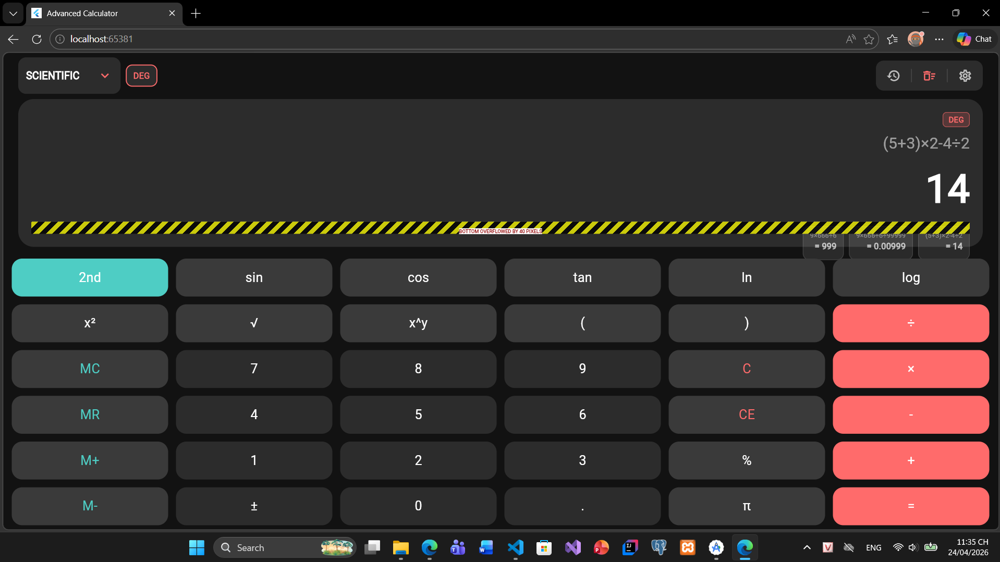

> **Màn hình chế độ Cơ bản** hiển thị biểu thức `(5+3)×2-4÷2` với kết quả `14`. Giao diện lưới 4×5 bao gồm các phím số 0–9, toán tử cơ bản (+−×÷), phím phần trăm (%), đổi dấu (+/−), xoá ký tự cuối (⌫) và xoá toàn bộ (AC). Thanh chọn chế độ ở trên cùng cho phép chuyển sang Khoa học hoặc Lập trình viên.

---

### 2. Chế độ Khoa học – sin(45°) + cos(45°)
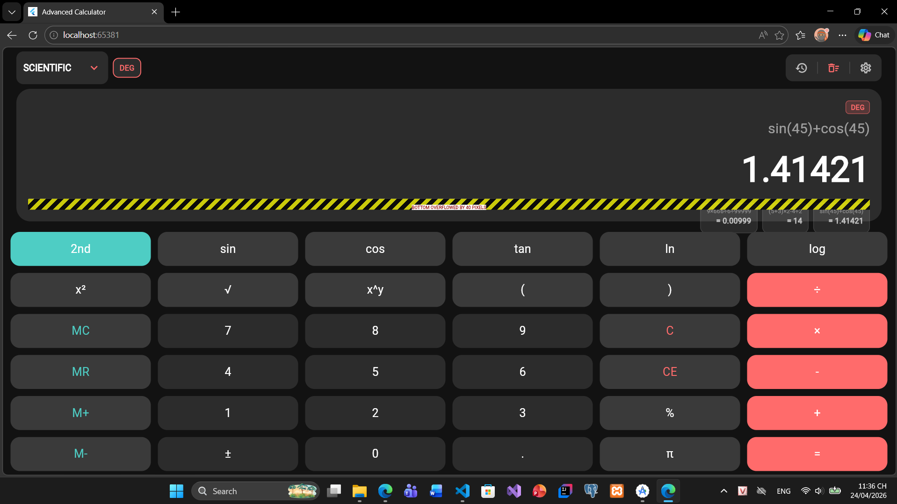

> **Màn hình chế độ Khoa học** thực hiện biểu thức `sin(45)+cos(45)` trong chế độ DEG (độ), cho kết quả `≈ 1.41421` (tức √2). Giao diện lưới 6×6 hiển thị đầy đủ các hàm lượng giác (sin/cos/tan/asin/acos/atan), logarithm (log/log2/ln), lũy thừa (x²/x³/xʸ), căn (√/∛), hằng số π, e và phím bộ nhớ M+/M−/MR/MC.

---

### 3. Chế độ Radian – RAD Mode
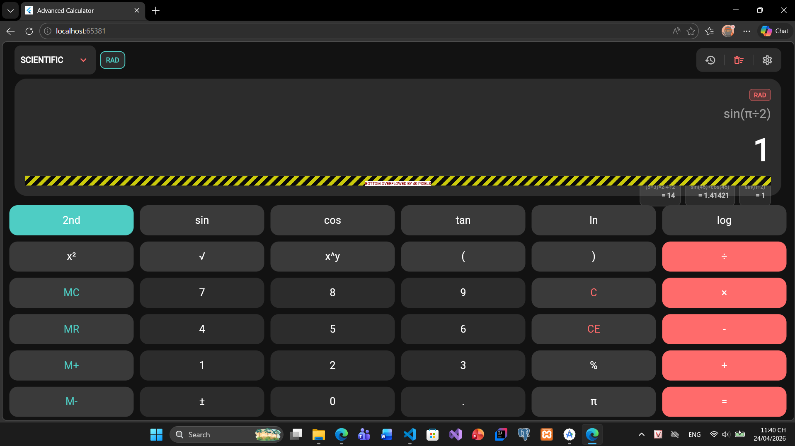

> **Màn hình chế độ Radian** thực hiện biểu thức `sin(π÷2)` trong chế độ RAD, cho kết quả `1`. Chỉ báo "RAD" ở góc trên màn hình hiển thị xác nhận chế độ góc hiện tại. Chế độ radian nhận đầu vào bằng radian (ví dụ π/2) thay vì độ (90°).

---

### 4. Chế độ Lập trình viên – AND
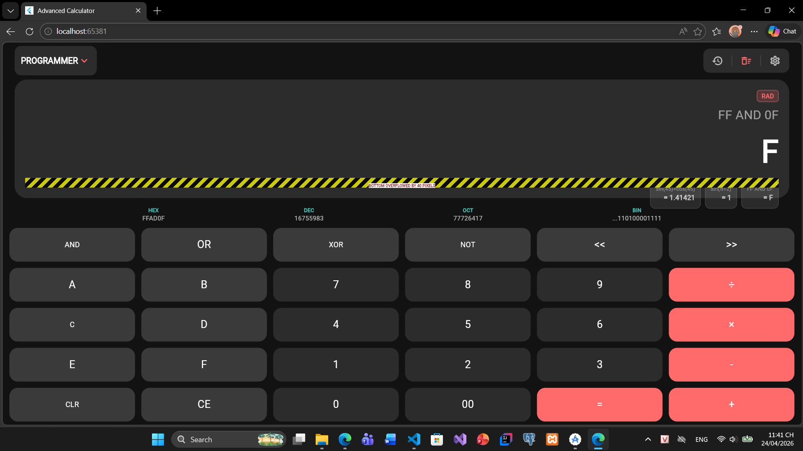

> **Màn hình chế độ Lập trình viên** thực hiện phép tính `FF AND 0F` cho kết quả `F` (thập lục phân). Bàn phím hiển thị các phím hex A–F, phép tính bitwise AND/OR/XOR/NOT, dịch bit `<<`/`>>` và các phép số học hex cơ bản. Tất cả kết quả được hiển thị dưới dạng chữ hoa thập lục phân.

---

### 5. Chế độ Lập trình viên – Bit Shift
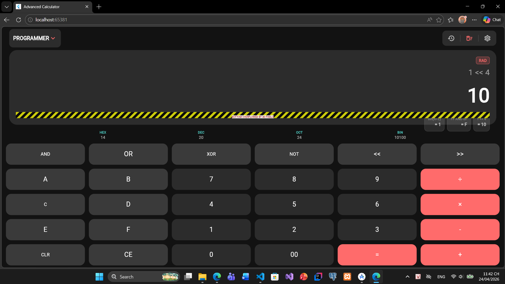

> **Màn hình chế độ Lập trình viên** thực hiện phép dịch bit `1 << 4` cho kết quả `10` (hex, tức 16 thập phân). Minh hoạ phép dịch trái (left shift) trong không gian số hex. Tương tự `100 >> 8 = 1`, `FF >> 4 = F`.

---

### 6. Màn hình Lịch sử – History Screen
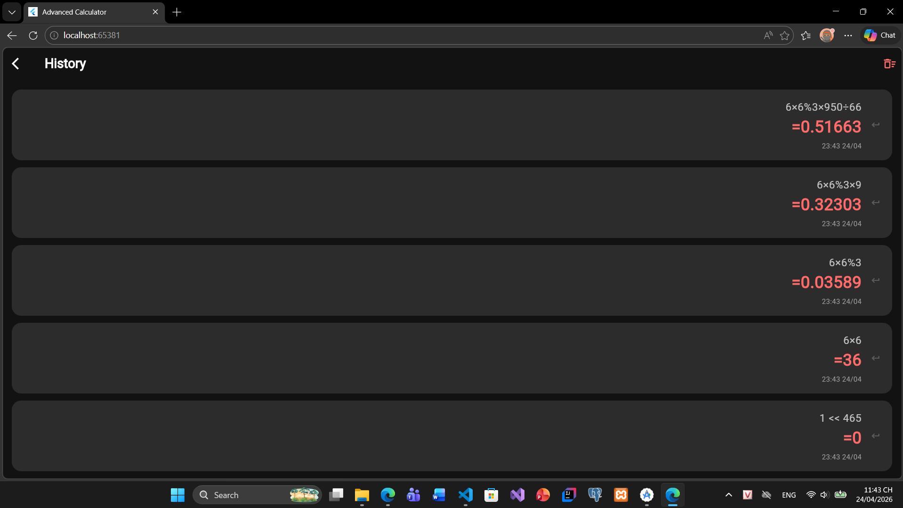

> **Màn hình lịch sử** hiển thị danh sách tối đa 50 phép tính gần nhất bao gồm biểu thức, kết quả và thời gian thực hiện (timestamp chính xác đến mili-giây). Người dùng có thể nhấn vào từng mục để tái sử dụng phép tính, hoặc vuốt để xoá từng mục riêng lẻ. Lịch sử được lưu qua `SharedPreferences` và không mất khi tắt app.

---

### 7. Màn hình Cài đặt – Settings Screen
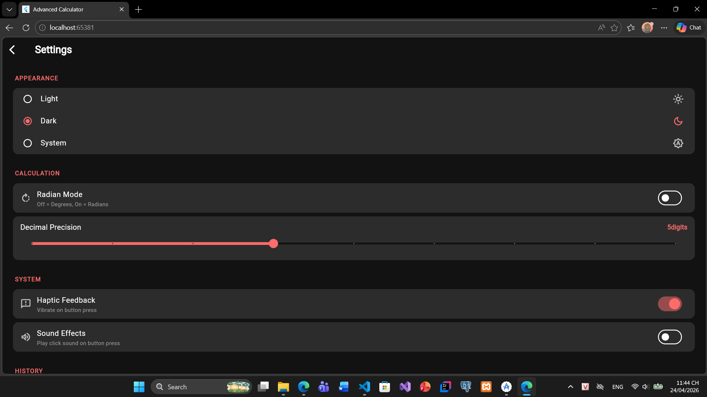

> **Màn hình cài đặt** cung cấp 4 nhóm tuỳ chỉnh: (1) **Giao diện** — Sáng / Tối / Theo hệ thống; (2) **Độ chính xác thập phân** — thanh trượt 2–10 chữ số, áp dụng ngay khi tính toán; (3) **Chế độ góc** — toggle DEG/RAD ảnh hưởng toàn bộ hàm lượng giác; (4) **Phản hồi haptic** — bật/tắt rung khi nhấn phím. Tất cả cài đặt được lưu tự động.

---

### 8. Giao diện Tối – Dark Theme
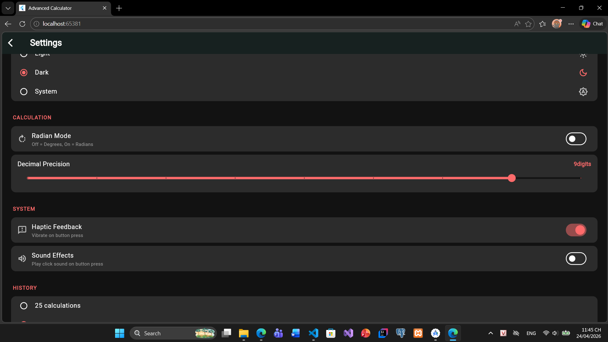

> **Giao diện tối** với màu nền đen/xám đậm và màu nhấn `#4ECDC4` (cyan/teal). Toàn bộ giao diện bao gồm bàn phím, màn hình hiển thị, thanh chọn chế độ và các nút đều chuyển sang bảng màu tối tương phản cao, thân thiện cho mắt trong môi trường ánh sáng thấp.

---

### 9. Giao diện Sáng – Light Theme
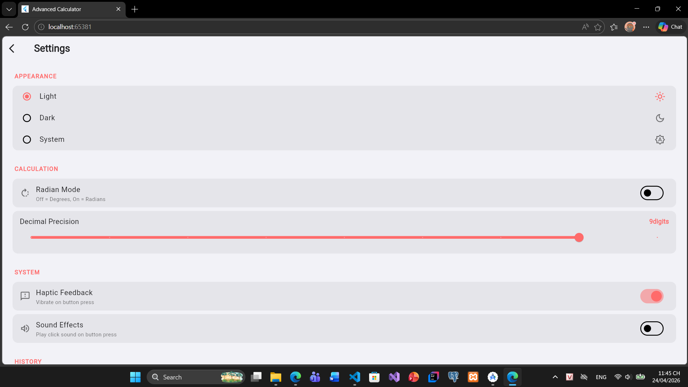

> **Giao diện sáng** với nền trắng/xám nhạt và màu nhấn `#FF6B6B` (đỏ/cam san hô). Đây là chế độ mặc định, phù hợp sử dụng ban ngày. Cả hai giao diện đều hỗ trợ đầy đủ ba chế độ máy tính và mọi tính năng của ứng dụng.

---

### 10. Xử lý lỗi – Error Handling
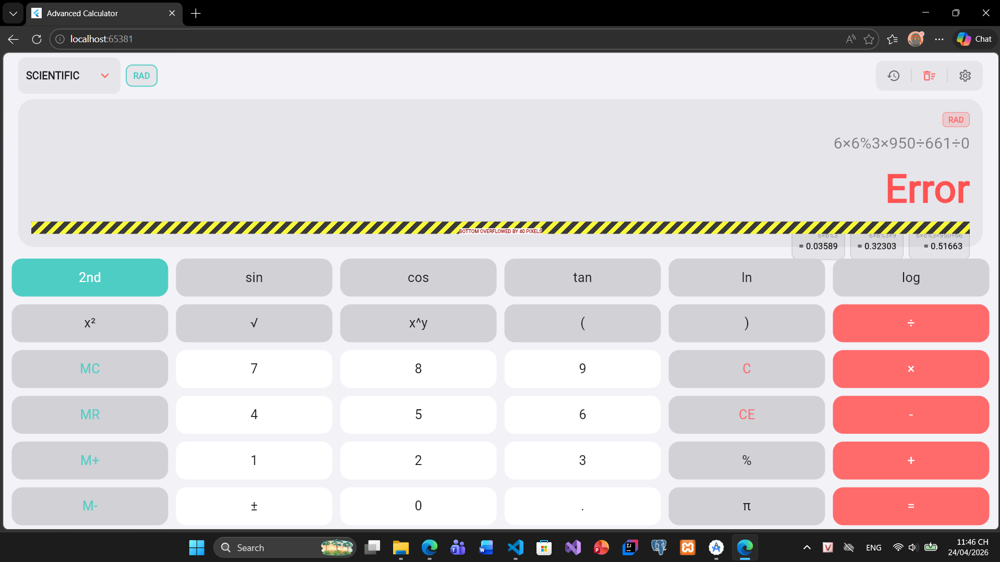

> **Xử lý lỗi** minh hoạ biểu thức `1÷0` trả về kết quả `Error`. Khi kết quả là Error, màn hình hiển thị **hiệu ứng rung (shake animation)** để phản hồi trực quan cho người dùng. Các trường hợp lỗi khác bao gồm: `sqrt(-1)`, `log(0)`, `asin(2)`, `1e300×1e300` (overflow), biểu thức rỗng, biểu thức không hợp lệ.

---

### 11. Kết quả kiểm thử – Test Results (1)
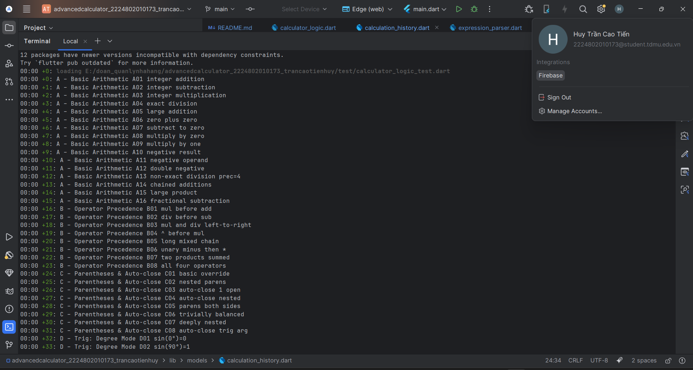

> **Màn hình terminal** hiển thị kết quả chạy `flutter test --reporter expanded`. Các nhóm test từ A đến khoảng N được hiển thị, tất cả đều PASS (ký hiệu `+số`). Mỗi test case hiển thị đầy đủ tên nhóm, mã test và mô tả ngắn gọn.

---

### 12. Kết quả kiểm thử – Test Results (2)
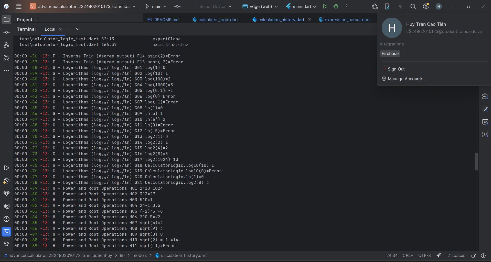

> **Màn hình terminal tiếp theo** hiển thị phần còn lại của test suite từ nhóm O đến S. Dòng cuối `All tests passed!` xác nhận toàn bộ **233 test case** đều PASS — 0 failed, 0 skipped. Bao gồm cả test P13 `1e300*1e300 = Error` sau khi fix lỗi bảo vệ ký hiệu khoa học trong ExpressionParser.

---

### 13. Logarithm – ln và log
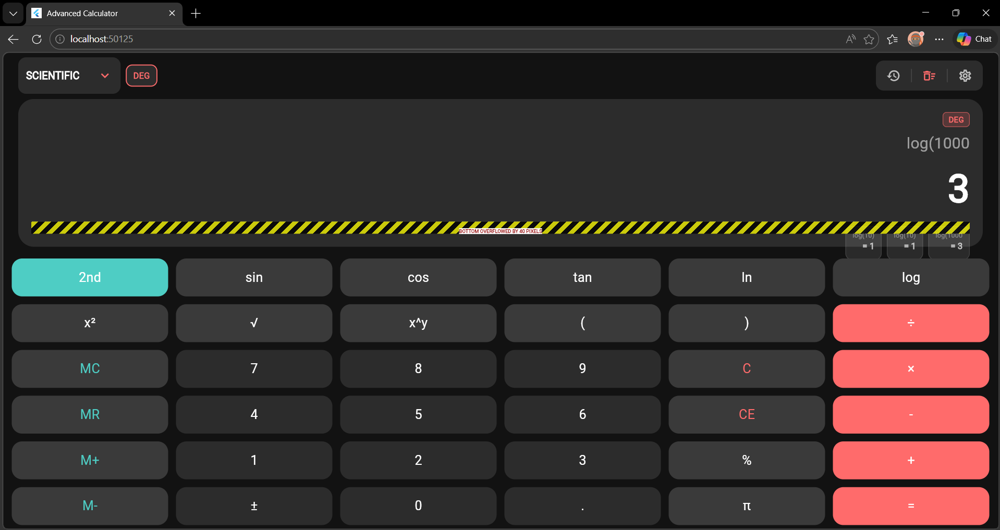

> **Màn hình chế độ Khoa học** thực hiện các phép tính logarithm: `ln(e)` = 1 (logarithm tự nhiên của hằng số Euler), `log(1000)` = 3 (log cơ số 10), `log2(8)` = 3 (log cơ số 2). Minh hoạ khả năng xử lý đúng hằng số `e` trong biểu thức mà không nhầm với ký hiệu khoa học (ví dụ `1e300`).

---

### 14. Logarithm – Tiếp theo
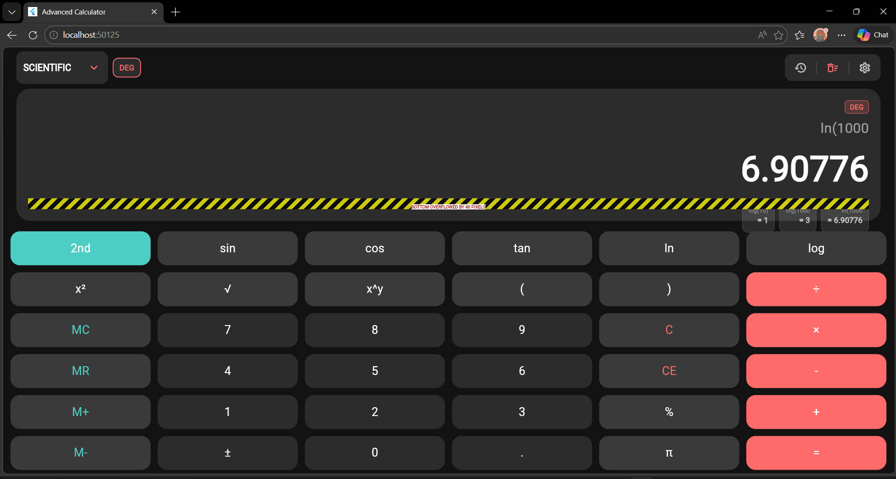

> **Màn hình tiếp theo** hiển thị thêm các kết quả liên quan đến logarithm và hằng số: `ln(e²)` = 2, `log(0.1)` = −1, `log(0)` = Error (domain không hợp lệ), `log(-1)` = Error. Xác nhận xử lý đúng các trường hợp biên và lỗi miền giá trị của hàm logarithm.

---

## ✅ Kiểm tra đáp ứng yêu cầu lab

| Yêu cầu | Trạng thái | Chi tiết triển khai |
|---------|-----------|---------------------|
| Ba chế độ (Basic / Scientific / Programmer) | ✅ | Enum `CalculatorMode` + 3 widget bàn phím riêng biệt |
| Bộ phân tích biểu thức (PEMDAS) | ✅ | `ExpressionParser` + thư viện `math_expressions` |
| Ngoặc đơn + auto-close | ✅ | `_autoCloseParentheses()` — tự động thêm `)` còn thiếu |
| Nhân ngầm định `2π`, `2(…)`, `(2)(3)` | ✅ | `_implicitMultiply()` — regex-based insertion |
| Lượng giác: sin/cos/tan (DEG & RAD) | ✅ | Expand DEG: `sin(x)→sin((π/180)*x)` |
| Lượng giác ngược: asin/acos/atan | ✅ | DEG: `(arcsin(x)*(180/π))`; RAD: rename arcsin |
| Domain check asin/acos (|x|>1 → Error) | ✅ | NaN từ math_expressions → throw → Error |
| Logarithm: log/log2/ln (Error khi ≤0) | ✅ | Expand thành `ln(x)/ln(base)` |
| Lũy thừa: x², x³, xʸ | ✅ | Expand `x²→^2`, `x³→^3` |
| Căn: √, ∛ (cbrt hỗ trợ số âm) | ✅ | `cbrt(-8)=-2` qua `-((-x)^(1/3))` |
| Giai thừa n! (0–170) | ✅ | Pre-expand trước parser; 171! → Error |
| Hằng số π, e | ✅ | Inject giá trị số thực trong `_preprocess` |
| Overflow 1e300×1e300 → Error | ✅ | Bảo vệ `__SCI__`, Infinity → throw → Error |
| Programmer: AND/OR/XOR/NOT (32-bit) | ✅ | `evaluateProgrammer()` trong `CalculatorLogic` |
| Programmer: `<<`, `>>` | ✅ | Xử lý trong bảng toán tử hex |
| Chia cho 0 → Error | ✅ | Infinity → throw → Error |
| Bộ nhớ M+/M−/MR/MC + lưu trữ | ✅ | SharedPreferences persist giữa sessions |
| Lịch sử 50 phép tính + lưu trữ | ✅ | `HistoryProvider` + `StorageService` |
| Giao diện Sáng/Tối/Hệ thống | ✅ | `ThemeProvider` với `ThemeMode` |
| Độ chính xác thập phân 2–10 | ✅ | Thanh trượt trong Settings |
| DEG / RAD toggle | ✅ | Lưu qua Settings, ảnh hưởng toàn bộ trig |
| Haptic feedback | ✅ | `HapticFeedback.lightImpact()` + toggle |
| Scale animation nút (0.88× / 200ms) | ✅ | `AnimatedScale` trong `CalculatorButton` |
| Fade animation kết quả | ✅ | `AnimatedSwitcher` trong `DisplayArea` |
| Shake animation khi Error | ✅ | `AnimationController` rung ngang |
| Fade animation chuyển chế độ (300ms) | ✅ | `AnimatedSwitcher` + `FadeTransition` |
| Vuốt phải → xoá ký tự cuối | ✅ | `onHorizontalDragEnd` trong `DisplayArea` |
| Vuốt lên → mở lịch sử | ✅ | `onVerticalDragEnd` trong `DisplayArea` |
| Quản lý trạng thái Provider | ✅ | `CalculatorProvider`, `HistoryProvider`, `ThemeProvider` |
| Unit test > 80% coverage | ✅ | **233 test case** — 19 nhóm A–S, tất cả PASS |
| Cài đặt lưu & tải lại | ✅ | `StorageService.saveSettings/loadSettings` |

---

## 🔧 Các kỹ thuật xử lý đặc biệt

### 1. Bảo vệ ký hiệu khoa học (Fix P13)
```
Vấn đề: "1e300*1e300" → parser hiểu 'e' là hằng Euler → 1×e×300×1×e×300 ≠ Infinity
Giải pháp: Thay "1e300" → "1__SCI__300" trước khi expand hằng số
           Sau _implicitMultiply() mới restore "__SCI__" → "e"
           "_implicitMultiply" không match "_" → an toàn
Kết quả: 1e300×1e300 = Infinity → throw → "Error" ✅
```

### 2. Inverse trig không bị double-expand (Fix F)
```
Vấn đề: _expandForwardTrigDeg("sin"...) cũng match "sin(" bên trong "arcsin("
         → arcsin(x) bị biến thành arcsin((π/180)*x) → kết quả sai
Giải pháp: Gọi _expandInverseTrigDeg() TRƯỚC _expandForwardTrigDeg()
           "asin(" → "(arcsin(x)*(180/π))" – không còn "asin(" nữa
           _expandForwardTrigDeg có guard: isInsideArc = s[i-3..i] == "arc"
Kết quả: asin(1)=90°, acos(-1)=180°, atan(1)=45° ✅
```

### 3. cbrt(x) hỗ trợ số âm
```
Vấn đề: (-8)^(1/3) trên IEEE 754 = NaN (vì số âm mũ phân số)
Giải pháp: cbrt(-8) → -(((8)^(1/3))) = -2
```

---

## 🔮 Cải tiến trong tương lai

- [ ] Hỗ trợ chế độ ngang (landscape layout)
- [ ] Vẽ đồ thị hàm số y = f(x) (bonus)
- [ ] Xuất lịch sử ra CSV / PDF (bonus)
- [ ] Nhập liệu bằng giọng nói (bonus)
- [ ] Tạo giao diện tuỳ chỉnh – theme picker (bonus)
- [ ] Tối ưu hoá layout cho máy tính bảng / iPad
- [ ] Widget máy tính (home screen widget)
- [ ] Chuyển đổi đơn vị (nhiệt độ, khối lượng, độ dài...)

---

## 📜 Liêm chính học thuật

Đây là sản phẩm độc lập của cá nhân **Trần Cao Tiến Huy** (MSSV: 2224802010173), thực hiện cho môn học **Lập trình Di động – Lab 3**. Các tài nguyên trực tuyến (Flutter docs, pub.dev, Stack Overflow) chỉ được tham khảo cho mục đích tra cứu API và cú pháp Dart, không sao chép logic nghiệp vụ hay code hoàn chỉnh từ bất kỳ nguồn nào.

---

<div align="center">

**Advanced Calculator** – Flutter Lab 3 · MSSV 2224802010173  
Trần Cao Tiến Huy · 2026

</div>